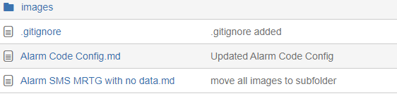

# 1: 有用的好 **工具**
bitbucket vscode webstorm jdk eclipse idea notepad++ [Forticlient VPN](http://www.fortinet.com)



#  2: vs code**小技巧**

## 1. 如何關閉小地圖
```
view -> show mini map
```
## 2. 如果調整背景色
```
File-Preferences -> Color Theme
```

# 3: 其它 **小技巧**

## 1. github上如何刪除一個project or repository
```
your repositories -> select your project which you want to delete -> slide to setting Tab -> draw down to bottom->select Delete this repository
```
## 2. github上項目如何轉為公有
```
your repositories -> select your project which you want to delete -> slide to setting Tab -> draw down to bottom->select make public
```
## 3. markdown 基本語法 

     [參考簡書上的link](https://www.jianshu.com/p/191d1e21f7ed)

## 4.Windows下使用notepad++对文本进行行列转换
 ***
* 行转列： 
    Ctrl + F  选择替换
    查找目标：填写指定的内容
　　替换为：\r\n
　　查找模式：正则表达式
* 列转行：
   Ctrl + F  选择替换
   查找目标：\r\n
   替换为：不填写或填写指定的内容
   查找模式：正则表达式
 ***
 ## 5. 如何把本地Jar轉為maven依賴
```
mvn install:install-file -DgroupId=com.alipay -DartifactId=sdk-Java -Dversion=0.1 -Dpackaging=jar -Dfile=alipay-sdk-java0.1.jar
```

